# AI 开发生态与阶段化学习路径

日期：2026-03-13  
目的：将 LangChain、RAG、向量数据库、CrewAI、AI 编程工具、大模型基础等结构化归纳为「阶段 + 课程」，便于扩展与按阶段学习。

---

## 一、AI 开发技术全景（按领域归类）

### 1. 大模型与基础

| 类别 | 内容 | 说明 |
|------|------|------|
| 概念 | Token、Context Window、Completion、Chat | 理解调用与计费、上下文长度 |
| 概念 | Prompt 工程、Few-shot、System/User Message | 与模型交互的基本方式 |
| 概念 | Function Calling / Tool Use | 模型输出结构化调用，Agent 基础 |
| 接口 | OpenAI API、OpenAI 兼容（通义、DeepSeek、Kimi 等） | 统一 HTTP/SDK 调用 |
| 接口 | 流式输出、异步、重试与限流 | 生产常用能力 |

### 2. 应用层框架（编排与 Agent）

| 框架/技术 | 定位 | 典型用途 |
|-----------|------|----------|
| **LangChain** | 链式编排、组件库、生态 | LCEL 链、单 Agent、RAG 流水线、与向量库/工具集成 |
| **LangGraph** | 有状态图、多步与分支 | 多步 Agent、Human-in-the-loop、工作流 |
| **CrewAI** | 多智能体、角色与任务 | 多 Agent 协作、Task/Crew、人设与契约 |
| **LlamaIndex** | 数据连接与检索 | 文档加载、索引、查询引擎，常与 RAG 搭配 |
| **AutoGen（微软）** | 多 Agent 对话与协作 | 对话式多 Agent、代码执行 |
| **Semantic Kernel（微软）** | 插件与编排 | 企业场景、插件化技能 |
| **Pydantic AI / OpenAI Agents SDK** | 轻量 Agent、结构化 I/O | 快速单 Agent、类型安全 |

### 3. RAG 与检索

| 类别 | 内容 | 说明 |
|------|------|------|
| 文档 | Loader、Splitter（按字符/Token/语义） | 文档进库前的预处理 |
| 向量 | Embedding 模型、向量维度、归一化 | 文本→向量，影响检索质量 |
| 检索 | Retriever、相似度、MMR、HyDE、多路召回 | 从向量库取上下文 |
| 生成 | 上下文注入、Prompt 模板、引用与溯源 | RAG 链后半段 |
| 评估 | 检索准确率、答案相关性、幻觉检测 | RAG 效果度量 |

### 4. 向量数据库与存储

| 技术 | 类型 | 典型场景 |
|------|------|----------|
| **Chroma** | 嵌入式/服务 | 本地开发、小规模、易上手 |
| **FAISS** | 内存索引 | 单机、只读或小规模更新 |
| **pgvector** | PostgreSQL 扩展 | 已有 PG 栈、事务与 SQL 结合 |
| **Milvus / Qdrant / Weaviate** | 独立向量库 | 大规模、分布式、过滤与混合检索 |
| **Elasticsearch + 向量** | 全文 + 向量 | 已有 ES、混合搜索 |
| **Supabase / Pinecone** | 托管服务 | 快速上线、免运维 |

### 5. AI 编程与协作工具

| 工具 | 用途 | 与本仓库关系 |
|------|------|--------------|
| **Cursor** | AI 驱动 IDE、Agent、规则与技能 | 日常编码、规则配置、技能扩展 |
| **Claude Code / Cursor Agent** | 自然语言驱动编码、多步执行 | 实战：如何写 Prompt、用 Agent 做小项目 |
| **GitHub Copilot** | 行级/块级补全 | 辅助编码 |
| **OpenClaw** | 基于 CrewAI 的本地工作助手 | 多 Agent 实战、工具与记忆 |
| **MCP（Model Context Protocol）** | 统一工具/资源暴露给 AI | CrewAI/LangChain 等接入外部能力 |
| **Skills / AGENTS.md** | 项目级 AI 行为与规范 | 与 Cursor/Claude 配合的工程实践 |

### 6. 生产与治理

| 类别 | 内容 |
|------|------|
| 可观测 | LangSmith、LangTrace、OpenTelemetry、日志与 Trace |
| 评估 | Eval、LLM-as-Judge、回归测试、红队 |
| 安全与合规 | Guardrails、PII 脱敏、Prompt 版本与灰度 |
| 部署 | 容器化、Serverless、CI/CD、Knowledge 库流水线 |

---

## 二、阶段划分与课程映射

采用 **Phase + L（课）** 命名：`Phase{N}L{m}` 表示第 N 阶段第 m 课，便于后续在任意阶段追加新课。

```mermaid
flowchart LR
  subgraph Phase1 [Phase1 基础与认知]
    P1L1[L1 环境与 LLM]
    P1L2[L2 LLM 概念]
    P1L3[L3 AI 编程工具]
  end
  subgraph Phase2 [Phase2 LangChain]
    P2L1[L1 LCEL 与链]
    P2L2[L2 Agent 与工具]
    P2L3[L3 RAG 入门]
  end
  subgraph Phase3 [Phase3 向量与 RAG]
    P3L1[L1 向量数据库]
    P3L2[L2 RAG 进阶]
  end
  subgraph Phase4 [Phase4 CrewAI]
    P4L1[L1 Agent Task Crew]
    P4L2[L2 工具与 MCP]
    P4L3[L3 知识库与记忆]
  end
  subgraph Phase5 [Phase5 实战]
    P5L1[L1 OpenClaw]
    P5L2[L2 Claude Code 实战]
  end
  subgraph Phase6 [Phase6 生产与拓展]
    P6L1[L1 可观测与评估]
    P6L2[L2 LangGraph 与其他]
  end
  Phase1 --> Phase2 --> Phase3 --> Phase4 --> Phase5 --> Phase6
```

| 阶段 | 目录前缀 | 主题 | 主要技术与框架 |
|------|-----------|------|----------------|
| **Phase1 基础与认知** | Phase1L* | 环境、LLM 基础、AI 编程工具 | Python、OpenAI 兼容 API、Cursor、Claude Code |
| **Phase2 LangChain** | Phase2L* | 链、Agent、RAG 入门 | LangChain、LCEL、Tools、Retriever |
| **Phase3 向量与 RAG** | Phase3L* | 向量库、RAG 进阶与检索策略 | Chroma/FAISS/pgvector、Embedding、检索优化 |
| **Phase4 CrewAI** | Phase4L* | 多智能体、任务编排、工具与记忆 | CrewAI、MCP、知识库、Memory |
| **Phase5 实战** | Phase5L* | 综合项目与 AI 编程实战 | OpenClaw、Cursor Agent、Claude Code 实战 |
| **Phase6 生产与拓展** | Phase6L* | 可观测、评估、其他框架 | LangSmith/LangTrace、Eval、LangGraph、LlamaIndex 等 |

---

## 三、各阶段课程明细（可扩展）

### Phase1 基础与认知

| 课 | 目录 | 主题 | 内容要点 |
|----|------|------|----------|
| L1 | Phase1L1_env_and_llm | 环境与 LLM 接入 | Python/venv、API Key、.env、第一次调用 LLM（OpenAI 或通义等） |
| L2 | Phase1L2_llm_basics | 大模型基础 | Token、Context、Prompt/Completion、System/User、Function Calling 概念 |
| L3 | Phase1L3_ai_coding_tools | AI 编程工具 | Cursor 使用、Claude Code、规则与 Skills、Copilot 对比 |

### Phase2 LangChain

| 课 | 目录 | 主题 | 内容要点 |
|----|------|------|----------|
| L1 | Phase2L1_lcel_chain | LCEL 与链 | Runnable、管道符、PromptTemplate、OutputParser、invoke/stream |
| L2 | Phase2L2_agent_tools | Agent 与工具 | ReAct、Tools 定义与绑定、AgentExecutor、单 Agent 闭环 |
| L3 | Phase2L3_rag_intro | RAG 入门 | DocumentLoader、TextSplitter、Embedding、VectorStore、简单 RAG 链 |

### Phase3 向量与 RAG

| 课 | 目录 | 主题 | 内容要点 |
|----|------|------|----------|
| L1 | Phase3L1_vector_db | 向量数据库 | Chroma/FAISS/pgvector 选型与使用、索引、查询、过滤 |
| L2 | Phase3L2_rag_advanced | RAG 进阶 | 检索策略、MMR、多路召回、评估与调优 |

### Phase4 CrewAI

| 课 | 目录 | 主题 | 内容要点 |
|----|------|------|----------|
| L1 | Phase4L1_agent_task_crew | Agent、Task、Crew | Role/Goal/Backstory、Task 与 context、Process、Crew.kickoff |
| L2 | Phase4L2_tools_mcp | 工具与 MCP | 自定义 Tool、MCP 协议、工具注册与过滤 |
| L3 | Phase4L3_knowledge_memory | 知识库与记忆 | 知识库、Embedding 集成、Short/Long-term、Entity Memory |

### Phase5 实战

| 课 | 目录 | 主题 | 内容要点 |
|----|------|------|----------|
| L1 | Phase5L1_openclaw | OpenClaw 实战 | 基于 CrewAI 的本地助手、工具链、多 Agent 协作 |
| L2 | Phase5L2_claude_code | Claude Code / Cursor 实战 | 用 Agent 完成小项目、规则与技能编写、迭代流程 |

### Phase6 生产与拓展

| 课 | 目录 | 主题 | 内容要点 |
|----|------|------|----------|
| L1 | Phase6L1_observability_eval | 可观测与评估 | LangSmith/LangTrace、Eval、LLM-as-Judge、日志与 Trace |
| L2 | Phase6L2_langgraph_others | LangGraph 与其他框架 | LangGraph 图与状态、LlamaIndex/AutoGen 等简要对比与选型 |

---

## 四、与仓库目录的对应关系

- 根目录 **llm/**、**tools/** 为公共依赖，各阶段课程均可引用。
- 每课对应一个 **Phase{N}L{m}_* ** 目录，目录内放置该课脚本、Notebook 及本课 README。
- 新增课程时：在对应 Phase 下增加 `Phase{N}L{m+1}_主题` 即可，无需改其他阶段。

上述阶段与课程列表为结构化总结，实际目录名以 README 与仓库中的「项目结构」为准。
